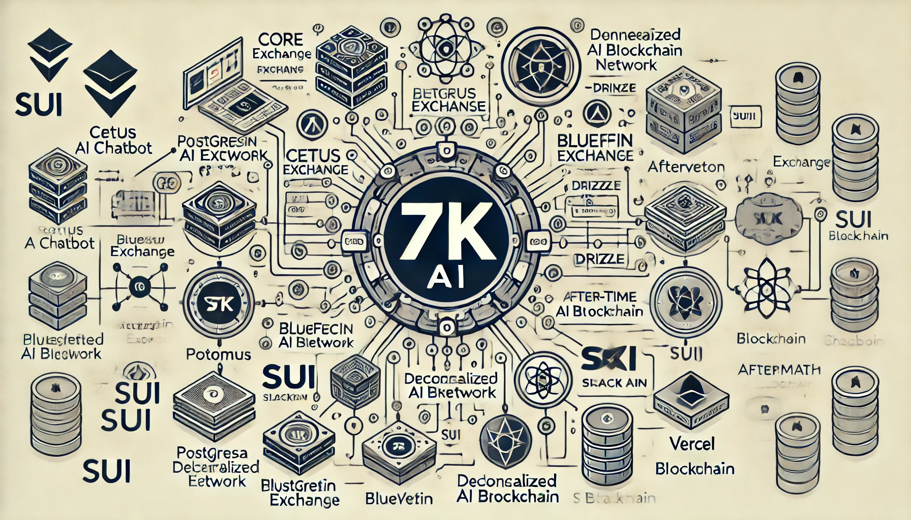
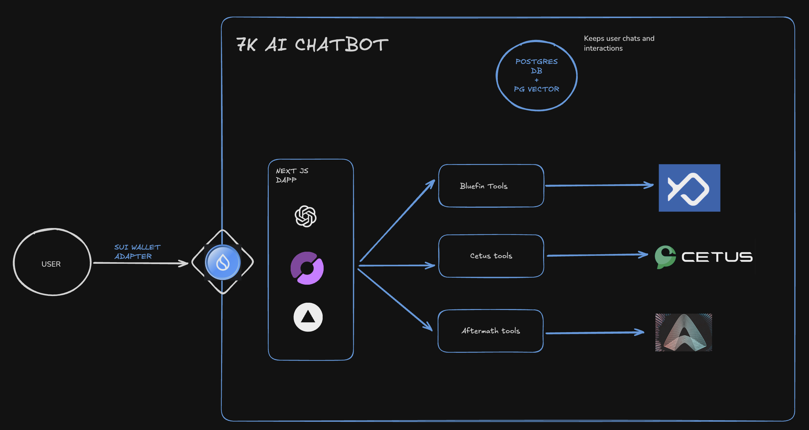

# 7k-ai-chatbot - Sui Typhoon hackathon project



## Description

This is a chatbot that uses AI to answer questions about the Sui blockchain and its ecosystem. 

Built with: 

- Next.js
- Shadcn
- PostgreSQL & pgVector
- Vercel ai sdk
- OpenAI
- Sui wallet adapter
- Atoma
- Bluefin
- Cetus 
- Aftermath

### Features

- Chat with the chatbot about the Sui blockchain and its ecosystem.
- Integration with Atom decentralized AI agent.
- Integration with Bluefin exchange.
- Integration with Cetus exchange.
- Integration with Aftermath exchange.


### Tech Stack

- Node >= 22
- Yarn
- Next.js
- PostgreSQL & pgVector

---

### Development

1. Set right node version. Ensure you have nvm installed.

```bash
nvm use
```

2. Ensure you have yarn installed, if not install it with `npm install -g yarn`.

3. Install dependencies

```bash
yarn
```

4. Copy .env.example to .env and set the correct variables.

```bash
cp .env.example .env
```

Environment variables needed:

* ATOMA_API_KEY: Atoma api key. You can get one in https://cloud.atoma.network/
* OPENAI_API_KEY: OpenAI api key. You can get one in https://platform.openai.com/
* AUTH_SECRET: Secret key for authentication. You can generate one with `openssl rand -base64 32`
* POSTGRES_URL: Postgres url. You can get one in https://vercel.com/docs/storage/vercel-postgres/quickstart
* SUI_PRIVATE_SEEDPHRASE: Sui private seed phrase to connect bluefin client. It can be any random private key.
* SUI_NETWORK: Sui network. It can be `MAINNET` or `TESTNET`.


### Architecture



### Integrating a new exchange

* To create a new tool integration, please refer to the [DEVELOPMENT.md](DEVELOPMENT.md) file.

---

### Scripts

- Description: To test exchange clients and atoma client. For further details check the [scripts/README.md](scripts/README.md) file.

---

### References

- Atoma:

  - [Official docs](https://cloud.atoma.network/)
  - [Documentation](https://docs.atoma.network/documentation/get-started/overview)

- Bluefin:

  - [Official site](https://bluefin.io/)
  - [Bluefin docs](https://learn.bluefin.io/bluefin?utm_source=bluefin&utm_medium=internal&utm_campaign=header)
  - [Bleufin api docs](https://bluefin-exchange.readme.io/reference/spot-api-introduction)

- Sui wallet adapter:

  - [Official docs](https://sdk.mystenlabs.com/dapp-kit)

- Cetus:

  - [Official site](https://www.cetus.zone/)
  - [Cetus docs](https://cetus-1.gitbook.io/cetus-developer-docs/developer/via-sdk/getting-started)

- Aftermath:

  - [Official site](https://aftermath.xyz/)
  - [Aftermath docs](https://docs.aftermath.finance/developers/aftermath-ts-sdk)

---

## Contributors
